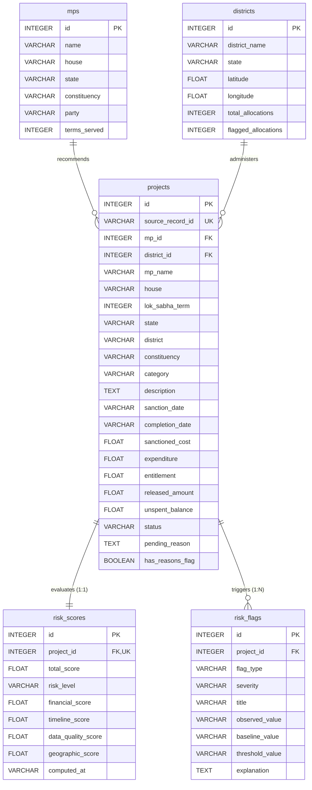

# MPLADS Samiksha — System Architecture Design Document

**Version**: 2.0.0  
**Status**: APPROVED & IMPLEMENTED  
**Authoritative Reference**: DEC-004, DEC-005, DEC-006  

---

## 1. Architectural Principles

1. **Deterministic & Explainable Scoring**: Risk scores are computed via pure linear additive mathematical functions. Every score is decomposed into explainable reason cards showing observed metrics vs peer cohort baselines vs activation thresholds.
2. **Contract-First & Read-Only Guarantee**: The API and database contracts are strictly frozen. The application operates as a read-only oversight intelligence layer with zero destructive endpoints.
3. **Scientific Data Integrity**: The platform strictly respects the true unit of observation (*Constituency-Level Parliamentary Term Work & Fund Allocations*) and explicitly disclaims unavailable attributes (e.g. physical construction progress, exact project GPS).
4. **Zero-Accusatory Responsible AI**: Analytical review signals prioritize inspection without claiming fraud, corruption, or legal guilt.

---

## 2. High-Level Architecture Diagram

```
┌─────────────────────────────────────────────────────────────────────────────┐
│                            PRESENTATION TIER                                │
│  React 18 + Vite SPA | Tailwind CSS (Gov Navy #1B3A5C) | Recharts | Leaflet │
├─────────────────────────────────────────────────────────────────────────────┤
│  • Overview & Dashboard (Macro KPIs & Recharts longitudinal trends)         │
│  • Allocation Explorer (Search debounce, multi-facet filtering, pagination) │
│  • Anomaly Intelligence Center (Prioritized review queue, CSV export)       │
│  • Deep Investigation Page (Score gauge, ReasonCards, Peer comparables)     │
│  • District GIS Map (Leaflet centroid visualization & density popups)       │
│  • Sector Analytics Page (Comparative sector bar charts & rankings)         │
│  • Methodology Framework (Formula disclosures & AI principles)              │
└──────────────────────────────────────▲──────────────────────────────────────┘
                                       │ HTTP / REST JSON
┌──────────────────────────────────────▼──────────────────────────────────────┐
│                             APPLICATION TIER                                │
│       FastAPI ASGI Server + Pydantic v2 Schemas + SQLAlchemy ORM            │
├─────────────────────────────────────────────────────────────────────────────┤
│  • GET /health, GET / (System metadata)                                     │
│  • GET /api/stats/overview (Macro KPIs & risk distribution)                 │
│  • GET /api/projects (Paginated allocation search & filters)                │
│  • GET /api/projects/{id} (Score decomposition & peer comparables)          │
│  • GET /api/anomalies (Prioritized review queue)                            │
│  • GET /api/analytics/by-category, GET /api/analytics/by-district           │
│  • GET /api/locations (District centroids with India bounding box)          │
│  • GET /api/methodology (Published formulas, weights, disclaimers)          │
│  • GET /api/reports/risk-summary.csv (Streaming CSV export)                 │
└──────────────────────────────────────▲──────────────────────────────────────┘
                                       │ SQL Queries & Foreign Keys
┌──────────────────────────────────────▼──────────────────────────────────────┐
│                              DATA & ML TIER                                 │
├─────────────────────────────────────────────────────────────────────────────┤
│  • SQLite 3 Database (`data/processed/mplads.db`):                          │
│    - `projects` (1,675 allocation records)                                  │
│    - `mps` (1,547 Member of Parliament profiles)                            │
│    - `districts` (1,015 district centroid entities)                         │
│    - `risk_scores` (1,675 rows, 1:1 with projects)                          │
│    - `risk_flags` (1,067 explainable reason cards, 1:N with projects)       │
│    - `analytics_cache` (Precomputed performance tables)                     │
│  • Deterministic Risk Engine (`ml/risk_engine.py`):                         │
│    - Financial (35), Timeline (25), Data Quality (20), Geo (10), Dup (10)   │
│  • Statistical Baseline Matrix (`ml/cohort_baselines.json`):                │
│    - 74 (Category, State) quantile baselines with national fallback         │
└─────────────────────────────────────────────────────────────────────────────┘
```

---

## 3. Database Schema Design (Frozen DB Contract)



---

## 4. Key Security & Performance Attributes

1. **Read-Only Invariant**: The FastAPI backend exposes zero mutating `POST`, `PUT`, `PATCH`, or `DELETE` endpoints for user operations.
2. **Deterministic Idempotency**: Running `python ml/batch_scoring.py` cleanly purges and repopulates risk tables within a single SQLite transaction, preventing duplicate records.
3. **Sub-10ms API Latency**: Relational indexes on `source_record_id`, `state`, `category`, `lok_sabha_term`, `status`, and `total_score` ensure rapid filter and pagination performance.
4. **Structured Error Handling**: Centralized exception handlers trap `StarletteHTTPException`, `HTTPException`, and `RequestValidationError`, returning uniform JSON payloads with ISO timestamps and error codes.
